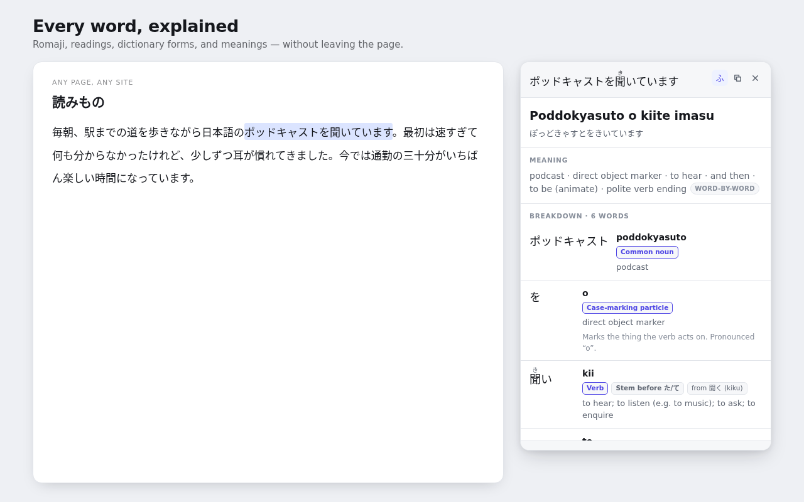

# Hodoku

A Chrome extension that turns highlighted Japanese into romaji, with a
word-by-word breakdown and the meaning of the sentence.

Select Japanese text on any page and a small **Romaji** button appears. Click it
(or press <kbd>Alt</kbd>+<kbd>R</kbd>, or use the right-click menu) and a panel
shows:

- the whole sentence in **Hepburn romaji**, with correct long vowels
- the **kana reading**, and furigana above each kanji
- a **word-by-word breakdown** — dictionary form, part of speech, how the word
  is inflected, and what it means
- plain-English **notes on particles and auxiliaries**

Anything worth coming back to can be **saved for review** with one click, then
studied or exported later.

All of that runs offline. An optional AI translation adds a fluent rendering of
the whole sentence if you supply your own API key — Claude or GPT, whichever you
already have.

<p align="center">
  
</p>

---

## How it works

```
content script  ──selection──▶  service worker  ──▶  offscreen document
  (shadow-DOM panel)              (settings,            └─ Web Worker
                                   optional API call)      ├─ kuromoji + IPADIC → segmentation, readings, inflection
                                                           └─ compiled JMdict  → English meanings
```

Three pieces are worth calling out:

**Why an offscreen document.** The dictionaries are about 26 MB compressed and
take a moment to parse. MV3 service workers are killed when idle, so loading
them there would mean re-parsing everything on every lookup. The offscreen
document persists for the browser session and hosts a Web Worker, so the
dictionaries load once and every later lookup is instant.

**Why `pronunciation` and not `reading`.** IPADIC gives both how a word is
written in kana and how it is said. Romaji needs the latter: 王 is written オウ
but said オー, so it romanises as `ō` — while 追う, also written オウ, really is
`ou`. The topic particle は falls out of the same field as `wa`. The romaji
converter itself never guesses at vowel length; it transcribes exactly the kana
it is handed, and the analyser hands it the pronunciation.

**Why the dictionary is compiled.** `scripts/build-dict.mjs` turns JMdict's
~118 MB of JSON into an 8 MB gzipped lookup table keyed by headword, so a
runtime lookup is one property access.

## Layout

```
src/
  lib/            analysis engine — no chrome.* APIs, unit-testable
    kana.ts         script detection, kana conversion, furigana alignment
    romaji.ts       Hepburn conversion, four output styles
    grammar.ts      IPADIC labels → learner-facing English, particle notes
    tokenizer.ts    kuromoji loader built on fetch + DecompressionStream
    dict.ts         compiled JMdict lookup
    analyzer.ts     ties it together into an Analysis
    translate.ts    optional AI translation (dispatch)
    providers/      one module per provider; registry.ts is SDK-free
  content/        in-page panel (shadow DOM); render.ts is shared with previews
  background/     service worker: settings, offscreen lifecycle, API calls
  offscreen/      host for the analysis worker
  worker/         the worker itself
    saved.ts        saved-sentence store, study ordering, export
    translation-cache.ts  LRU cache so a sentence is never paid for twice
    anki.ts         AnkiConnect client (loopback only)
  popup/ options/ extension pages
  review/         saved list, study mode, Anki/JSON export
scripts/          build, dictionary compilation, icons, screenshots, packaging
store/            Web Store listing copy, privacy policy, generated assets
tests/            unit tests plus an end-to-end suite over the real dictionaries
```

## Development

Everything runs inside the dev container — nothing is installed on the host.

```bash
devcontainer up --workspace-folder .
```

Then, inside the container:

```bash
npm run build:dict      # download and compile JMdict (a few minutes, once)
npm run release         # icons + dictionary + bundle + tests + zip
```

Day to day:

| Command | What it does |
| --- | --- |
| `npm run dev` | Rebuild on change. Load `dist/` at `chrome://extensions` with Developer mode on. |
| `npm run build` | One-off production bundle into `dist/` |
| `npm test` | Unit tests, plus an end-to-end suite against the real dictionaries |
| `npm run smoke` | Drives the built extension in real Chrome |
| `npm run smoke:anki` | Drives the Anki export against a mock AnkiConnect server |
| `npm run typecheck` | `tsc --noEmit` |
| `npm run build:icons` | Regenerate the icon set (pure geometry, no image dependency) |
| `npm run build:screenshots` | Render the store screenshots from real analyser output |
| `npm run package` | Verify `dist/` and zip it into `release/` |

To run commands without opening a shell in the container:

```bash
devcontainer exec --workspace-folder . npm test
```

## Publishing to the Chrome Web Store

`store/LISTING.md` has the listing copy, the permission justifications, the
privacy-tab answers, and a pre-submission checklist. In short:

1. Bump `version` in **both** `package.json` and `src/manifest.json`
2. `npm run release`
3. Upload `release/hodoku-<version>.zip`
4. Paste the copy from `store/LISTING.md` and publish `store/PRIVACY.md` at a
   public URL

### Two things to decide before you publish

**The name.** It ships as *Hodoku — Japanese Sentence Breakdown*. 解く/ほどく
means "to untie, to unravel", which is what the panel does to a sentence. The
Japanese-reading corner of the Web Store is crowded with hover dictionaries
(Yomichan, Yomitan, Yomitai, 10ten, Japanese IO), so the name deliberately
avoids the "Yomi-" prefix and leads on *sentence* rather than *dictionary*.
Nothing here is WaniKani-derived — that is a trademark of Tofugu LLC, and using
it in a listing for an unaffiliated extension invites a takedown. A check for
product-name collisions was done; a **registered-trademark search was not**, and
is worth doing before publishing.

**The `<all_urls>` content script.** Reviewers scrutinise this, and it does
lengthen review. It is genuinely required — the point is to explain Japanese
wherever you meet it — and the justification in `store/LISTING.md` says so. The
extension requests no host permissions at install time; a provider host
(`api.anthropic.com` or `api.openai.com`) is requested at runtime only if you
turn on AI translation, and only for the provider you selected.

## Saving for review

The bookmark in the panel header saves the current sentence; clicking it again
removes it. "Save for review" is also on the right-click menu, which skips the
panel entirely. The toolbar popup shows how many are saved and opens the list.

The review page (`review/review.html`) supports search, sorting, a flashcard
study mode, and export to **TSV for Anki** or JSON.

Saved records hold what the panel displayed — text, romaji, kana, and the full
meaning snapshot (translation, literal rendering, grammar note, and which model
produced it) plus where it came from. The word breakdown is **re-derived on
demand** when an item is expanded.

**A model translation is never downgraded.** Re-saving a sentence while AI
translation is off, or after the API failed, keeps the snapshot that was already
paid for; only a newer model result replaces it. Readings and the source page
still refresh either way. That keeps records under 1 KB, so the store fits in
`chrome.storage.local` without an `unlimitedStorage` permission, and it means
improvements to the analyser apply retroactively to everything already saved.

Re-saving the same sentence updates the existing entry rather than duplicating
it, keeping its original save date and review history.

Study order is "never reviewed first, then longest since reviewed". It is
deliberately **not** a spaced-repetition schedule — inventing intervals would be
pretending to be Anki, which is what the export is for.

## Anki export

Options → **Anki export** sends saved sentences into your own Anki collection
via the [AnkiConnect](https://ankiweb.net/shared/info/2055492159) add-on's local
HTTP API. This is the recommended way to actually study them — Anki does real
spaced repetition, and its own sync carries the cards to your phone.

No server, no account, nothing over the internet: the host permission is
**loopback only** (`http://127.0.0.1/*`, `http://localhost/*`), requested at the
moment you enable the feature.

One-time setup on the Anki side, because AnkiConnect checks the `Origin` header:
open **Tools → Add-ons → AnkiConnect → Config** and add the extension's origin
to `webCorsOriginList`. The options page shows the exact
`chrome-extension://…` string with a copy button, since the ID is only knowable
at runtime.

**Furigana** is on by default: readings appear above the kanji on the back of
the card as `<ruby>` HTML, which every Anki client renders without a template
change or an add-on. (Anki's own ` 漢字[かんじ]` bracket notation is the
ecosystem convention, but it only becomes ruby if the card template calls
`{{furigana:…}}`, and shows literal brackets otherwise.) The front stays plain —
readings there would give the answer away.

The alignment is **not** stored on the saved record; it is re-derived from the
analyser when the card is sent, so sentences saved before this existed get
furigana too, and a failure costs that one card its ruby rather than the export.

Deck, note type, field mapping, and tags are all configurable; the deck is
created if it does not exist. **Test connection** populates the deck, note-type,
and field suggestions from your live collection. Items already sent are marked
*In Anki* and skipped on the next send, and notes go with
`allowDuplicate: false` so Anki gets the final say.

## Optional AI translation

Off by default and not required for anything else. When enabled, the background
service worker calls the selected provider with the user's own key and asks for
a fluent translation, a literal rendering, and one grammar note.

Two providers are supported, and they are interchangeable — same prompt, same
JSON output contract, so the panel looks identical either way:

| Provider | API | Default model |
| --- | --- | --- |
| Claude (Anthropic) | Messages API, structured outputs, low effort | `claude-opus-5` |
| GPT (OpenAI) | Responses API, strict JSON schema, low reasoning effort | `gpt-5.4` |

The model field is free text with suggestions, so a model released after this
build can still be used. Keys and models are stored per provider, so switching
back and forth does not lose anything.

Host permission is requested **only for the provider in use**, at the moment it
is enabled, and the other provider's permission is revoked on switch. Adding a
third provider means one entry in `src/lib/providers/`.

### Caching

A translation is a pure function of (text, provider, model), so results are
cached in `chrome.storage.local` and reused. Re-reading a page, or re-opening
something saved for review, costs nothing and works with no network at all.

- The key includes provider and model, so switching either produces a fresh
  translation rather than silently reusing the other one's output.
- Keys are hashed (FNV-1a) because the raw text can be 400 characters and the
  map is read and written whole; the stored text is compared on read so a hash
  collision misses rather than returning the wrong sentence.
- 500 entries, evicted least-recently-used. Options shows the entry count, how
  many times the cache has been reused, and a Clear button.
- The lookup happens **before** the permission check and the network call, and
  concurrent requests for the same sentence collapse into one API call.
- Cached translations are marked with a dot on the model badge; the tooltip says
  it was reused rather than re-fetched.

### Regenerating

The Meaning section carries a **Regenerate** button that asks again, bypassing
the cache. Next to it is a provider picker listing **only providers you have a
key for** — offering one without a key could only ever produce an error. With a
single provider configured the picker collapses to a label, since there is
nothing to choose.

A regenerated result replaces the cache entry and, if the sentence is saved, its
stored snapshot too — you regenerate because the last answer was not good
enough, so the old one should not survive anywhere.

The chosen provider applies to that request only; it does not change the default
in the options.

If the call fails the panel falls back to the offline gloss and shows why, so a
missing key or a rate limit never blocks the rest of the extension.

## Licences and attribution

The extension bundles two third-party datasets. Both are redistributable, and
both require attribution, which appears on the options page. See
[NOTICE.md](NOTICE.md) for the full text.

- **kuromoji** and **IPADIC** — Apache License 2.0
- **JMdict** — © Electronic Dictionary Research and Development Group,
  CC BY-SA 4.0

The two API clients (`@anthropic-ai/sdk`, MIT; `openai`, Apache-2.0) ship in the
background worker only.
